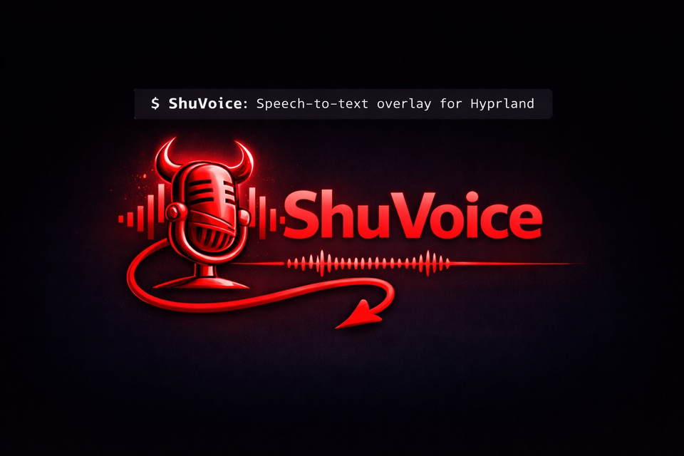
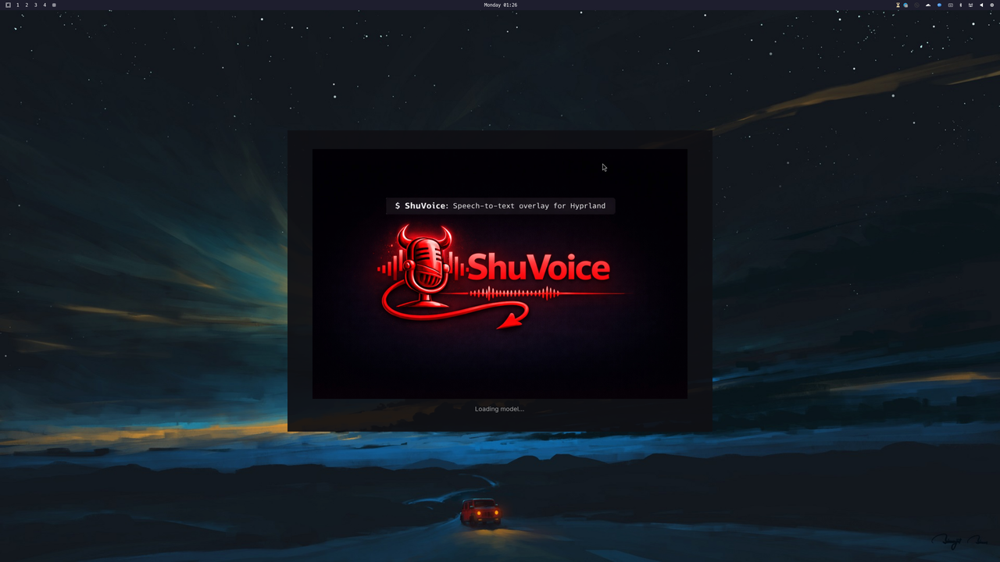
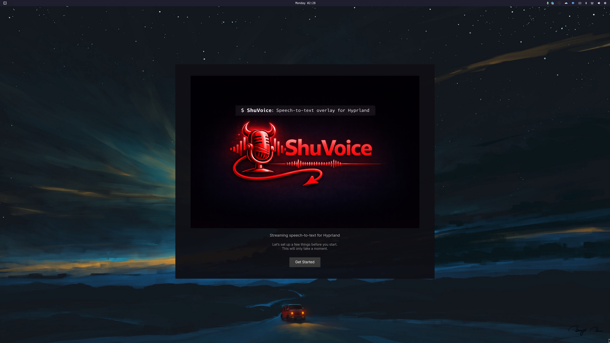
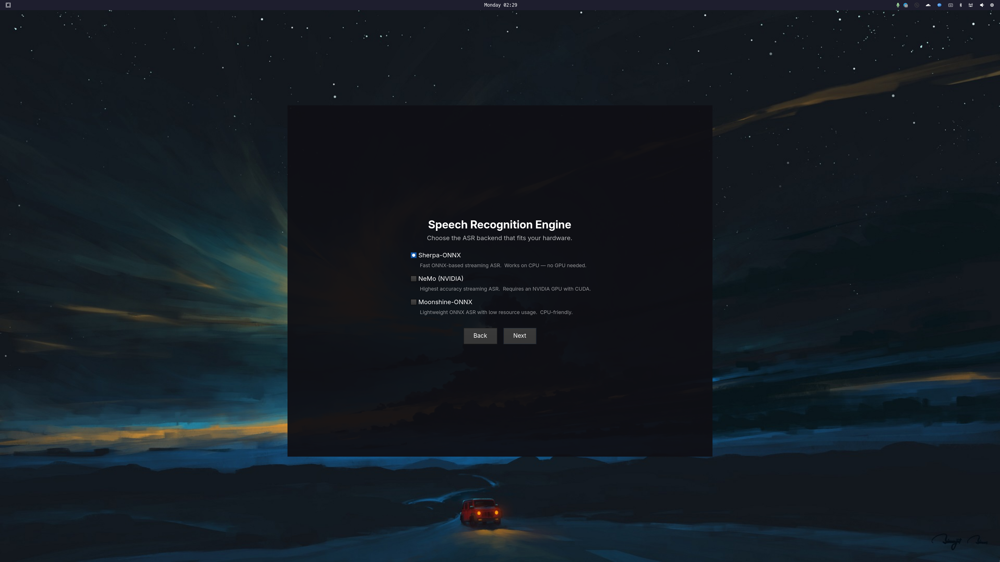
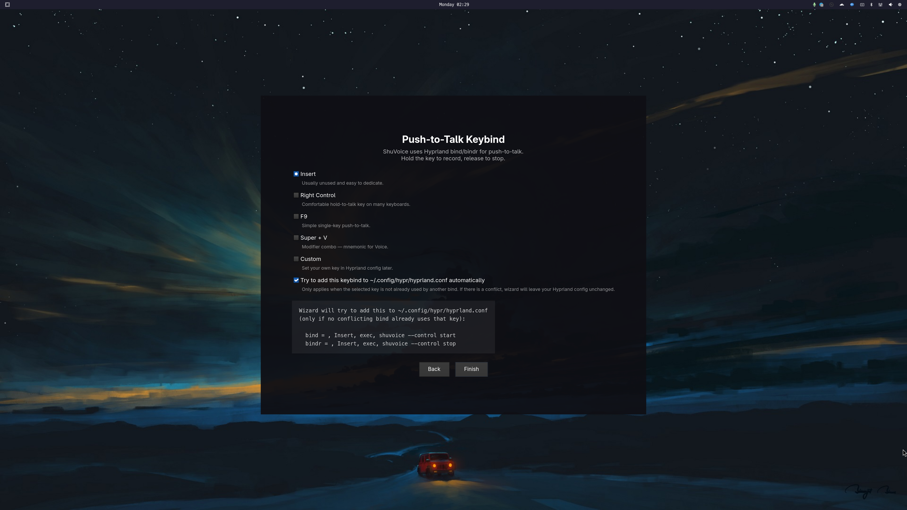
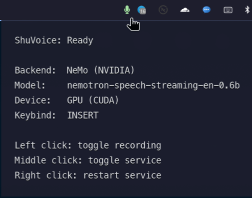

# ShuVoice

<p align="center">
  <picture>
    <source media="(prefers-color-scheme: dark)" srcset="./docs/assets/branding/shuvoice-variant-dark-lockup.png">
    <source media="(prefers-color-scheme: light)" srcset="./docs/assets/branding/shuvoice-variant-light-lockup.png">
    
  </picture>
</p>

<p align="center">
  <strong>Push-to-talk speech-to-text for Hyprland/Wayland.</strong><br>
  Hold a key, speak, release — your words are typed into the focused window.
</p>

<p align="center">
  <a href="https://github.com/shuv1337/shuvoice/actions/workflows/ci.yml"></a>
  <a href="https://aur.archlinux.org/packages/shuvoice-git"></a>
  <a href="LICENSE"></a>
</p>

<p align="center">
  
</p>

## Features

- **Push-to-talk dictation** — hold a key, speak, release. Text appears in your focused app.
- **Pluggable ASR backends** — choose between NeMo (highest accuracy), Sherpa-ONNX (fast, CPU-friendly), or Moonshine (lightweight).
- **Text-to-speech** — highlight text and hear it read aloud via ElevenLabs, OpenAI, or local Piper.
- **Native Wayland overlay** — GTK4 layer-shell overlay with blur, transparency, and live transcription feedback.
- **Waybar integration** — tray-style status icon with tooltip, state colors, and click actions.
- **Guided setup wizard** — interactive GTK wizard walks you through backend, keybind, and model selection.
- **Zero root access** — runs entirely in userspace via Hyprland IPC; no `/dev/input` needed.

---

## Quick Start

The fastest path from zero to working dictation:

```bash
# 1. Install from AUR (Arch Linux)
yay -S shuvoice-git

# 2. Run the setup wizard (picks backend, keybind, downloads model)
shuvoice wizard

# 3. Enable and start the background service
systemctl --user enable --now shuvoice.service

# 4. Use it! Hold your push-to-talk key, speak, release.
```

That's it. The wizard handles backend selection, model downloads, and Hyprland keybind setup.

> **Not on Arch?** See [Manual Installation](#manual-installation-from-source) below.

---

## Installation

### Option A: AUR Package (recommended)

ShuVoice is available on the AUR as [`shuvoice-git`](https://aur.archlinux.org/packages/shuvoice-git):

```bash
# Using yay
yay -S shuvoice-git

# Or using paru
paru -S shuvoice-git
```

The AUR package includes Sherpa-ONNX runtime support out of the box. If your
AUR helper asks which provider to use for `python-sherpa-onnx`, pick
**`python-sherpa-onnx-bin`** (recommended, prebuilt):

```bash
yay -S --needed python-sherpa-onnx-bin shuvoice-git
```

NeMo and Moonshine backends are optional and can be installed separately if needed.

### Option B: Manual Installation (from source)

<details>
<summary><strong>Expand for manual/venv setup instructions</strong></summary>

#### Prerequisites

| Component | Requirement |
|---|---|
| OS | Linux with Wayland (Hyprland recommended) |
| Python | 3.10 or newer |
| Package manager | [uv](https://docs.astral.sh/uv/getting-started/installation/) (recommended) |
| GPU | Optional (recommended for NeMo / Sherpa CUDA) |

#### 1. Install system dependencies (Arch Linux)

```bash
sudo pacman -S \
  gtk4 gtk4-layer-shell python-gobject \
  portaudio pipewire pipewire-audio pipewire-alsa \
  wtype wl-clipboard espeak-ng
```

#### 2. Clone and set up the project

```bash
git clone https://github.com/shuv1337/shuvoice.git
cd shuvoice

# Create venv and install base dependencies
uv sync
```

#### 3. Install your chosen ASR backend

Pick **one** (or more) backend to install:

```bash
# Sherpa-ONNX (fast, CPU-friendly by default; CUDA-capable runtime auto-repaired by setup/wizard)
uv sync --extra asr-sherpa

# NeMo (highest accuracy, requires NVIDIA GPU + CUDA)
uv sync --extra asr-nemo

# Moonshine (lightweight, low resource usage)
uv sync --extra asr-moonshine
```

> **Python 3.14 + NeMo note:** use the override file to avoid build issues:
> ```bash
> uv sync --extra asr-nemo --override packaging/constraints/py314-overrides.txt
> ```

#### 4. Optional: install TTS extras

```bash
# ElevenLabs TTS (cloud, high quality)
uv sync --extra tts-elevenlabs

# OpenAI TTS (cloud)
uv sync --extra tts-openai

# Local TTS (Piper, experimental)
uv sync --extra tts-local
```

</details>

---

## First Run

### Setup Wizard (recommended)

The interactive wizard walks you through everything:

```bash
shuvoice wizard
```

<p align="center">
  
</p>

The wizard will:

1. **Select your ASR backend** — Sherpa-ONNX, NeMo, or Moonshine
2. **Choose a Sherpa profile** (if applicable) — Streaming (Zipformer) or Instant (Parakeet)
3. **Pick your push-to-talk key** — Right Ctrl, Insert, F9, Super+V, or custom
4. **Choose your TTS provider + default voice** — ElevenLabs or OpenAI
5. **Download model files** — with progress indicator and cancel support
6. **Auto-configure Hyprland keybinds** — adds `bind`/`bindr` lines if the key isn't already used

<p align="center">
  
  <br><br>
  
</p>

### Alternative: CLI Setup

If you prefer a non-interactive approach:

```bash
# Check dependencies, download models, run preflight
shuvoice setup

# Auto-install missing dependencies (when possible)
shuvoice setup --install-missing

# Quick dependency check only (skip model download + preflight)
shuvoice setup --skip-model-download --skip-preflight
```

### Preflight Check

Verify everything is ready before first launch:

```bash
shuvoice preflight
```

This checks Python version, required modules, audio devices, ASR/TTS backend
dependencies, required binaries (`wtype`, `wl-copy`, `wl-paste`), and GTK
layer-shell availability.

On CUDA hosts, `shuvoice setup --install-missing` now also attempts to build a
gpu-enabled Sherpa runtime in the venv and wire the required CUDA compat libs
when `sherpa_provider = "cuda"` is selected.

---

## Starting ShuVoice

### As a systemd user service (recommended)

```bash
# Enable and start (will auto-start on login)
systemctl --user enable --now shuvoice.service

# Check status
systemctl --user status shuvoice.service

# View logs
journalctl --user -u shuvoice.service -f
```

<details>
<summary><strong>Setting up the service for venv/source installs</strong></summary>

The default service unit expects `/usr/bin/shuvoice` (AUR install path).
For venv workflows, create an override:

```bash
# Copy the unit file
mkdir -p ~/.config/systemd/user
cp packaging/systemd/user/shuvoice.service ~/.config/systemd/user/

# Override the ExecStart for your venv
systemctl --user edit shuvoice.service
```

Add this override:

```ini
[Service]
ExecStart=
ExecStart=%h/repos/shuvoice/.venv/bin/shuvoice
```

Then reload and start:

```bash
systemctl --user daemon-reload
systemctl --user import-environment WAYLAND_DISPLAY DISPLAY XDG_RUNTIME_DIR HYPRLAND_INSTANCE_SIGNATURE DBUS_SESSION_BUS_ADDRESS XDG_CURRENT_DESKTOP XDG_SESSION_TYPE
systemctl --user enable --now shuvoice.service
```

</details>

### Manual launch (foreground)

```bash
# AUR install
shuvoice

# Source/venv install
shuvoice run
```

---

## Usage

### Push-to-Talk (STT)

Hold your configured push-to-talk key, speak, and release. The transcribed
text is typed into your focused window.

#### Hyprland Keybinds

The wizard configures these automatically, but you can set them manually in
`~/.config/hypr/hyprland.conf`:

```ini
# Push-to-talk (STT) — example using Right Ctrl
bind = , Control_R, exec, shuvoice control start --control-wait-sec 0
bindr = , Control_R, exec, shuvoice control stop --control-wait-sec 0
bindr = CTRL, Control_R, exec, shuvoice control stop --control-wait-sec 0

# Speak selected text (TTS)
bind = SUPER CTRL, S, exec, shuvoice control tts_speak --control-wait-sec 0
```

### Text-to-Speech (TTS)

Highlight text in any app, then press your TTS keybind (default: `Super+Ctrl+S`).
ShuVoice reads the selected text aloud using your configured TTS backend.

- Uses primary selection first, then clipboard fallback
- STT and TTS are mutually exclusive (starting one stops the other)
- Re-triggering while speaking interrupts and starts fresh

### Control Commands

Send commands to a running ShuVoice instance:

```bash
shuvoice control start       # Begin recording
shuvoice control stop        # Stop recording and type result
shuvoice control toggle      # Toggle recording on/off
shuvoice control status      # Show current state
shuvoice control metrics     # Show runtime metrics

# TTS commands
shuvoice control tts_speak   # Read selected text aloud
shuvoice control tts_stop    # Stop TTS playback
shuvoice control tts_status  # Show TTS state
```

### Useful CLI Commands

```bash
shuvoice --help              # Show all commands
shuvoice audio list-devices  # List audio input devices
shuvoice config effective    # Print merged effective config
shuvoice config validate     # Validate your config file
shuvoice model download      # Download model for active backend
shuvoice diagnostics         # Show runtime diagnostics
shuvoice wizard              # Re-run the setup wizard
```

---

## Configuration

Config file location: **`~/.config/shuvoice/config.toml`**

The wizard creates this for you. To edit manually, see the full reference at
[`examples/config.toml`](examples/config.toml).

### Switching ASR Backends

```toml
[asr]
asr_backend = "sherpa"     # sherpa | nemo | moonshine
```

Restart the service after changing:

```bash
systemctl --user restart shuvoice.service
```

### Backend Comparison

| Backend | Best For | GPU Required? | Accuracy | Speed |
|---|---|---|---|---|
| **Sherpa-ONNX** | General use, CPU systems | No (optional CUDA) | Good | Fast |
| **NeMo** | Maximum accuracy | Yes (CUDA) | Best | Medium |
| **Moonshine** | Low-resource systems | No (optional CUDA) | Fair | Varies |

<details>
<summary><strong>Detailed backend configuration</strong></summary>

#### Sherpa-ONNX

Default backend. Two profiles available:

- **Streaming** (Zipformer) — live partial transcription as you speak
- **Instant** (Parakeet) — transcribes on key release for higher accuracy

```toml
[asr]
asr_backend = "sherpa"
sherpa_provider = "cpu"              # cpu | cuda
sherpa_model_name = "sherpa-onnx-streaming-zipformer-en-kroko-2025-08-06"
sherpa_decode_mode = "auto"          # auto | streaming | offline_instant
```

Parakeet offline instant mode (recommended for Parakeet models):

```toml
[asr]
asr_backend = "sherpa"
sherpa_model_name = "sherpa-onnx-nemo-parakeet-tdt-0.6b-v3-int8"
instant_mode = true
sherpa_decode_mode = "offline_instant"
```

Models auto-download to `~/.local/share/shuvoice/models/sherpa/` when
`sherpa_model_dir` is unset.

#### NeMo

Highest accuracy. Requires NVIDIA GPU with CUDA.

```toml
[asr]
asr_backend = "nemo"
model_name = "nvidia/nemotron-speech-streaming-en-0.6b"
device = "cuda"                      # cuda | cpu
right_context = 13                   # 0-13; higher = more accurate, more latency
```

#### Moonshine

Lightweight, CPU-friendly. Best for short utterances.

```toml
[asr]
asr_backend = "moonshine"
moonshine_model_name = "moonshine/tiny"    # moonshine/tiny (fast) | moonshine/base (slower)
moonshine_provider = "cpu"                 # cpu | cuda
moonshine_max_window_sec = 5.0
```

</details>

### Text Injection Mode

Controls how transcribed text is typed into your focused app:

```toml
[typing]
typing_final_injection_mode = "auto"   # auto | clipboard | direct
```

| Mode | Behavior |
|---|---|
| `auto` (default) | Detects clipboard watchers and chooses the safest method automatically |
| `clipboard` | Copies text to clipboard and pastes with `Ctrl+V` |
| `direct` | Types text directly via `wtype` (avoids clipboard) |

Quick toggle from CLI:

```bash
shuvoice config set typing_final_injection_mode direct
```

### Text Replacements

Add custom word/phrase corrections applied to transcribed text:

```toml
[typing.text_replacements]
"speech to text" = "speech-to-text"
"um" = ""                              # empty value deletes the word
```

Matches are case-insensitive, whole-word/phrase only (longest first). ShuVoice
includes built-in corrections for common ASR variants of "ShuVoice" and
"Hyprland".

### Instant Mode

Set `instant_mode = true` for low-latency tuning across all backends:

```toml
[asr]
instant_mode = true
```

Effects per backend:
- **NeMo:** forces `right_context = 0`
- **Sherpa streaming:** caps `sherpa_chunk_ms` at 80
- **Sherpa offline:** enables one-shot release-to-final decode
- **Moonshine:** forces `moonshine/tiny`, caps window to 3s and tokens to 48

### Overlay Appearance

```toml
[overlay]
font_size = 24
font_family = "JetBrains Mono"   # optional
bg_opacity = 0.55
```

Hyprland blur/transparency for the overlay:

```ini
# In hyprland.conf — ShuVoice uses layer-shell namespaces: stt-overlay, tts-overlay
layerrule = blur, stt-overlay
layerrule = ignorealpha 0.20, stt-overlay
layerrule = xray 1, stt-overlay

layerrule = blur, tts-overlay
layerrule = ignorealpha 0.20, tts-overlay
```

### TTS Configuration

```toml
[tts]
tts_enabled = true
tts_backend = "elevenlabs"                      # elevenlabs | openai | local
tts_default_voice_id = "zNsotODqUhvbJ5wMG7Ei"   # ElevenLabs default
# OpenAI defaults are auto-applied when tts_backend = "openai":
# tts_default_voice_id = "onyx"
# tts_model_id = "gpt-4o-mini-tts"
# tts_api_key_env = "OPENAI_API_KEY"
tts_model_id = "eleven_flash_v2_5"
tts_api_key_env = "ELEVENLABS_API_KEY"          # env var name (not the key itself)
```

Set your API key in `~/.config/shuvoice/local.dev`:

```bash
# ElevenLabs
ELEVENLABS_API_KEY=sk-your-key-here

# OpenAI
OPENAI_API_KEY=sk-your-key-here
```

### Example Configs

Pre-built config files for common setups:

| File | Description |
|---|---|
| [`examples/config.toml`](examples/config.toml) | Full reference with all options |
| [`examples/config-sherpa-cpu.toml`](examples/config-sherpa-cpu.toml) | Sherpa on CPU |
| [`examples/config-sherpa-cuda.toml`](examples/config-sherpa-cuda.toml) | Sherpa on GPU |
| [`examples/config-sherpa-parakeet-offline.toml`](examples/config-sherpa-parakeet-offline.toml) | Parakeet instant mode |
| [`examples/config-nemo-cuda.toml`](examples/config-nemo-cuda.toml) | NeMo on GPU |
| [`examples/config-nemo-cpu.toml`](examples/config-nemo-cpu.toml) | NeMo on CPU |
| [`examples/config-moonshine-cpu.toml`](examples/config-moonshine-cpu.toml) | Moonshine on CPU |

---

## Waybar Integration

<p align="center">
  
</p>

ShuVoice ships a Waybar helper (`shuvoice-waybar`) for a tray-style status icon.
When running on Hyprland, the tooltip also shows the configured TTS provider /
voice plus the detected push-to-talk and TTS keybinds.

Add to your Waybar config:

```jsonc
"custom/shuvoice": {
  "return-type": "json",
  "exec": "shuvoice-waybar status",
  "interval": 1,
  "on-click": "shuvoice-waybar toggle-record",
  "on-click-middle": "shuvoice-waybar service-toggle",
  "on-click-right": "shuvoice-waybar menu",
  "tooltip": true
}
```

State-based CSS styling:

```css
#custom-shuvoice.recording  { color: #f38ba8; }
#custom-shuvoice.processing { color: #fab387; }
#custom-shuvoice.idle       { color: #a6e3a1; }
#custom-shuvoice.starting   { color: #f9e2af; }
#custom-shuvoice.stopped    { color: #7f849c; }
#custom-shuvoice.error      { color: #f38ba8; }
```

<details>
<summary><strong>Waybar setup details</strong></summary>

Available commands:

```bash
shuvoice-waybar status          # JSON output for Waybar
shuvoice-waybar menu            # Right-click menu
shuvoice-waybar toggle-record   # Toggle recording
shuvoice-waybar service-toggle  # Start/stop systemd service
shuvoice-waybar launch-wizard   # Open setup wizard
```

Right-click menu uses one of: `omarchy-launch-walker`, `walker`, `wofi`,
`rofi`, `bemenu`, or `dmenu`.

If Waybar can't find `shuvoice-waybar` in PATH, use the wrapper script:

```bash
# Install a PATH symlink (default: ~/.local/bin/shuvoice-waybar)
./scripts/install-waybar-wrapper.sh

# Or point Waybar to the full path
# exec: "/home/you/.venv/bin/shuvoice-waybar status"
```

See [`examples/waybar-custom-shuvoice.jsonc`](examples/waybar-custom-shuvoice.jsonc)
and [`examples/waybar-shuvoice.css`](examples/waybar-shuvoice.css) for
complete examples.

</details>

---

## Troubleshooting

<details>
<summary><strong>Missing Python modules</strong></summary>

| Error | Fix |
|---|---|
| `No module named 'torch'` or `'nemo'` | `uv sync --extra asr-nemo` or install `python-pytorch-cuda` (Arch) |
| `No module named 'sherpa_onnx'` | AUR: `yay -S python-sherpa-onnx-bin` · venv: `uv sync --extra asr-sherpa` |
| `No module named 'moonshine_onnx'` | `uv sync --extra asr-moonshine` |
| `No module named 'gi'` | `sudo pacman -S python-gobject gtk4 gtk4-layer-shell` |

</details>

<details>
<summary><strong>Sherpa / Parakeet errors</strong></summary>

| Error | Fix |
|---|---|
| Missing `encoder/decoder/joiner` artifacts | Point `sherpa_model_dir` to a valid model directory, or unset it to auto-download |
| `Parakeet requires offline instant mode` | Use `sherpa_decode_mode = "offline_instant"` with `instant_mode = true` |
| `window_size does not exist in the metadata` | Use `sherpa_decode_mode = "offline_instant"` for that model, or switch to Zipformer |
| `CUDAExecutionProvider` not found | Install CUDA-enabled sherpa-onnx, or use `sherpa_provider = "cpu"` |

</details>

<details>
<summary><strong>Audio and recognition issues</strong></summary>

| Problem | Fix |
|---|---|
| Wrong microphone | Run `shuvoice audio list-devices`, then set `audio_device` by **name** (not index) in config |
| Mic too quiet | Increase `input_gain` (try `1.3` to `1.8`) |
| Phantom text on silent presses | Raise `silence_rms_threshold` (try `0.010`→`0.015`) or `silence_rms_multiplier` (try `2.0`) |
| Long phrases cut out | Keep `streaming_stall_guard = true` (default); tune `streaming_stall_chunks` (3–6) |
| Clipboard pollution | Set `typing_final_injection_mode = "auto"` (detects clipboard managers automatically) |

</details>

<details>
<summary><strong>System/runtime errors</strong></summary>

| Error | Fix |
|---|---|
| `libgtk4-layer-shell.so not found` | `sudo pacman -S gtk4-layer-shell` |
| `wtype not found in PATH` | `sudo pacman -S wtype` |
| `Control socket not found` | Start ShuVoice first before sending control commands |
| `espeak-ng not found` | `sudo pacman -S espeak-ng` (only needed for roundtrip test scripts) |
| `tts_speak` says no selected text | Highlight text first; verify `wl-paste` works |
| ElevenLabs/OpenAI 401 errors | Export the provider API key in the env var named by `tts_api_key_env`; run `shuvoice preflight` |
| `Failed to build kaldialign` (Python 3.14) | Use `uv sync --extra asr-nemo --override packaging/constraints/py314-overrides.txt` |

</details>

---

## Development

```bash
# Clone and install with dev tooling
git clone https://github.com/shuv1337/shuvoice.git
cd shuvoice
uv sync --dev

# Run checks
uv run ruff check shuvoice tests
uv run ruff format --check shuvoice tests
uv run pytest -m "not gui" -v
```

See [CONTRIBUTING.md](CONTRIBUTING.md) for full guidelines.

<details>
<summary><strong>Advanced test suites</strong></summary>

```bash
# IPC end-to-end smoke tests
pytest -m e2e -k ipc_smoke -v

# Manual phrase regression (opt-in)
SHUVOICE_RUN_ROUNDTRIP=1 \
SHUVOICE_ROUNDTRIP_BACKEND=nemo \
SHUVOICE_ROUNDTRIP_DEVICE=cuda \
pytest -m integration -k roundtrip_regression -v

# Long-phrase round-trip harness (TTS → STT)
python scripts/tts_roundtrip.py --asr-backend nemo --device cuda

# Smoke test script
./scripts/smoke-test.sh
```

</details>

---

## Project Links

| | |
|---|---|
| **Repository** | [github.com/shuv1337/shuvoice](https://github.com/shuv1337/shuvoice) |
| **AUR Package** | [shuvoice-git](https://aur.archlinux.org/packages/shuvoice-git) |
| **Contributing** | [CONTRIBUTING.md](CONTRIBUTING.md) |
| **Code of Conduct** | [CODE_OF_CONDUCT.md](CODE_OF_CONDUCT.md) |
| **Security** | [SECURITY.md](SECURITY.md) |
| **Brand Assets** | [docs/BRANDING.md](docs/BRANDING.md) |

## License

ShuVoice is released under the [MIT License](LICENSE).
