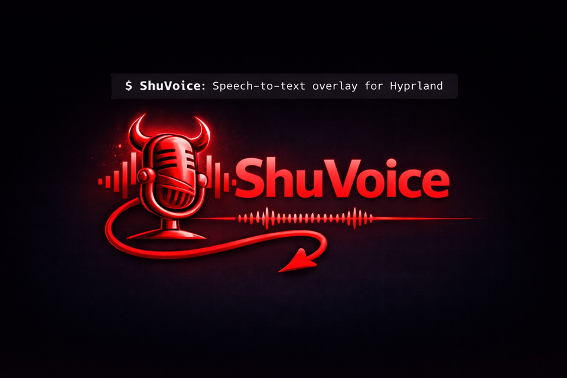
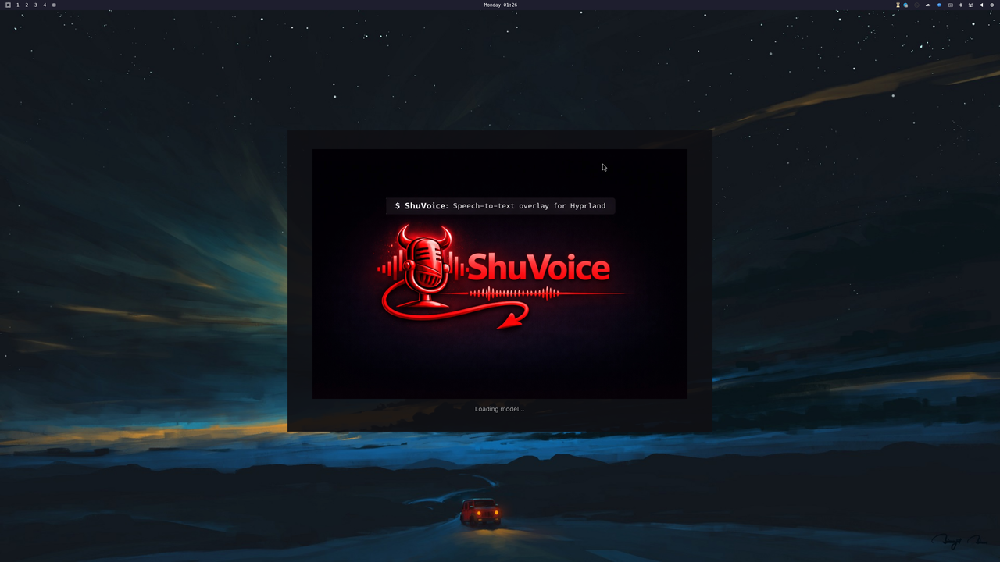
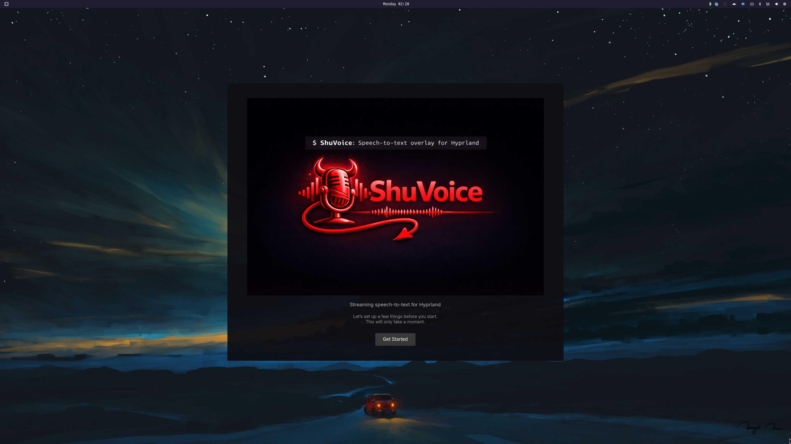
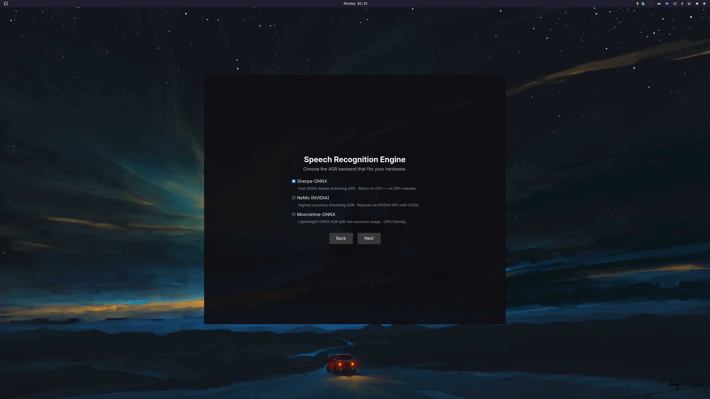
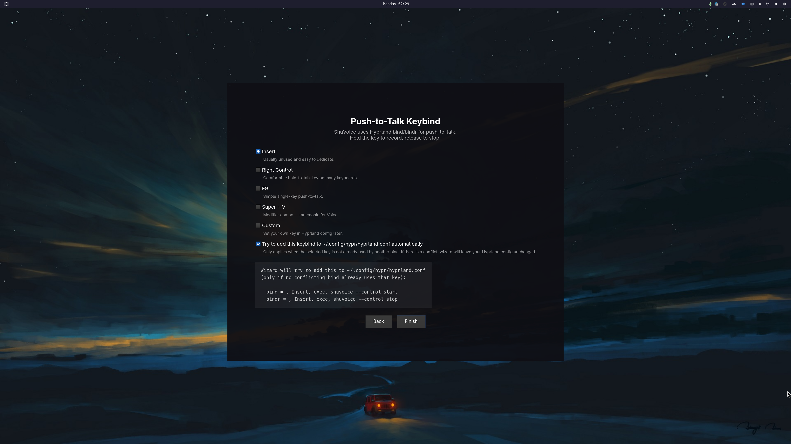
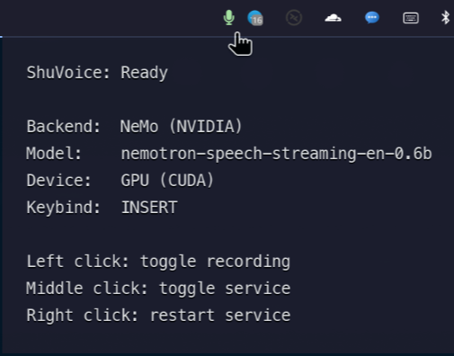

# ShuVoice

<p align="center">
  <picture>
    <source media="(prefers-color-scheme: dark)" srcset="./docs/assets/branding/shuvoice-variant-dark-lockup.png">
    <source media="(prefers-color-scheme: light)" srcset="./docs/assets/branding/shuvoice-variant-light-lockup.png">
    
  </picture>
</p>

<p align="center">
  <strong>Push-to-talk speech-to-text for Hyprland/Wayland.</strong><br>
  Hold a key, speak, release, and ShuVoice types the result into the focused window.
</p>

<p align="center">
  <a href="https://github.com/shuv1337/shuvoice/actions/workflows/ci.yml"></a>
  <a href="https://aur.archlinux.org/packages/shuvoice-git"></a>
  <a href="LICENSE"></a>
</p>

<p align="center">
  
</p>

## Features

- Push-to-talk dictation for Wayland desktops, optimized for Hyprland.
- Pluggable ASR backends: Sherpa-ONNX, NeMo, Moonshine, and OpenAI Realtime Whisper.
- Text-to-speech from selected text using ElevenLabs, OpenAI, Piper, MeloTTS, or Kokoro.
- Native GTK4 layer-shell overlay with live status and transcription feedback.
- Waybar status helper with recording, service, setup, and TTS actions.
- Guided setup wizard for backend selection, model download, keybinds, and service setup.
- Runs as a user service with no root input-device hooks.

## Quick Start

```bash
# 1. Install from AUR on Arch Linux
yay -S shuvoice-git

# 2. Run the setup wizard
shuvoice wizard

# 3. Enable and start the background service
systemctl --user enable --now shuvoice.service

# 4. Hold your push-to-talk key, speak, and release.
```

The wizard handles backend selection, model downloads, Hyprland keybinds,
final text injection mode, and optional TTS setup. For source installs,
dependency details, and service overrides, see [Installation](docs/INSTALLATION.md).

## First Run

Run the wizard:

```bash
shuvoice wizard
```

<p align="center">
  
</p>

The wizard walks through:

1. Welcome and environment checks
2. ASR backend selection
3. Sherpa profile and device choice when applicable
4. Push-to-talk key and final text injection mode
5. TTS provider, voice, speed, and provider settings
6. Model download and Hyprland keybind setup

<p align="center">
  
  <br><br>
  
</p>

## Usage

Hold your configured push-to-talk key, speak, and release. ShuVoice transcribes
the audio and injects final text into the focused app.

Useful commands:

```bash
shuvoice --help
shuvoice wizard
shuvoice preflight
shuvoice audio list-devices
shuvoice config effective
shuvoice control start
shuvoice control stop
shuvoice control status
shuvoice control tts_speak
shuvoice control tts_speak_clipboard
```

Recommended Hyprland binds:

```ini
bind = , Control_R, exec, shuvoice control start --control-wait-sec 0
bindr = , Control_R, exec, shuvoice control stop --control-wait-sec 0
bindr = CTRL, Control_R, exec, shuvoice control stop --control-wait-sec 0
bind = SUPER CTRL, S, exec, shuvoice control tts_speak --control-wait-sec 0
bind = SUPER CTRL SHIFT, S, exec, shuvoice control tts_speak_clipboard --control-wait-sec 0
```

`tts_speak` reads the primary selection first, then falls back to the clipboard.
`tts_speak_clipboard` reads only the system clipboard — useful in Zellij and
other terminals where you copy text explicitly before triggering TTS.

## Configuration

Primary config lives at `~/.config/shuvoice/config.toml`. The wizard writes it
for you, and manual reference examples live in `examples/`.

Common ASR choice:

```toml
[asr]
asr_backend = "sherpa"     # sherpa | nemo | moonshine | openai_realtime
```

Common typing choice:

```toml
[typing]
typing_final_injection_mode = "auto"   # auto | clipboard | direct
typing_text_case = "default"           # default | lowercase
```

See [Configuration](docs/CONFIGURATION.md) for backend profiles, text
replacements, overlay tuning, TTS providers, and example config links.

## Waybar

<p align="center">
  
</p>

ShuVoice includes `shuvoice-waybar`, a JSON-producing helper for a Waybar
`custom/shuvoice` module. It shows service state, recording state, configured
TTS voice, and keybind hints. See [Waybar Integration](docs/WAYBAR.md) for the
module config, CSS, and launcher actions.

## Troubleshooting

Start with:

```bash
shuvoice preflight
systemctl --user status shuvoice.service
journalctl --user -u shuvoice.service -n 80 --no-pager
```

Common fixes for missing Python modules, ASR backend errors, audio device
selection, clipboard behavior, GTK layer-shell, and TTS credentials are in
[Troubleshooting](docs/TROUBLESHOOTING.md).

## Development

```bash
git clone https://github.com/shuv1337/shuvoice.git
cd shuvoice
uv sync --dev
uv run ruff check shuvoice tests
uv run ruff format --check shuvoice tests
uv run pytest -m "not gui" -v
```

See [CONTRIBUTING.md](CONTRIBUTING.md) for the full contributor workflow.

## Project Links

| | |
|---|---|
| Repository | [github.com/shuv1337/shuvoice](https://github.com/shuv1337/shuvoice) |
| AUR Package | [shuvoice-git](https://aur.archlinux.org/packages/shuvoice-git) |
| Installation | [docs/INSTALLATION.md](docs/INSTALLATION.md) |
| Configuration | [docs/CONFIGURATION.md](docs/CONFIGURATION.md) |
| Waybar | [docs/WAYBAR.md](docs/WAYBAR.md) |
| Troubleshooting | [docs/TROUBLESHOOTING.md](docs/TROUBLESHOOTING.md) |
| Brand Assets | [docs/BRANDING.md](docs/BRANDING.md) |
| Security | [SECURITY.md](SECURITY.md) |

## License

ShuVoice is released under the [MIT License](LICENSE).
