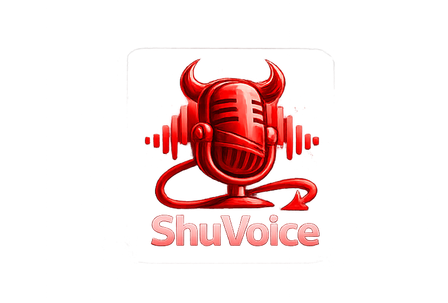
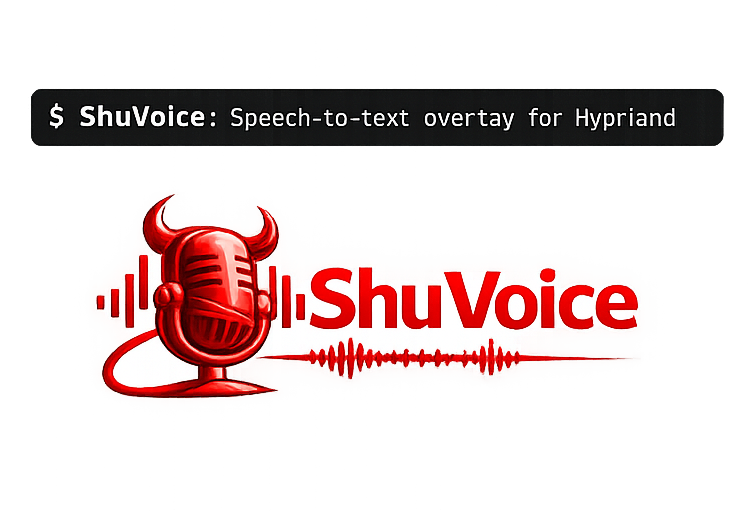

# ShuVoice brand assets

ShuVoice logo assets used by the repository live in:

- `docs/assets/branding/shuvoice-variant-dark-badge.png`
- `docs/assets/branding/shuvoice-variant-light-lockup.png`
- `docs/assets/branding/shuvoice-variant-dark-lockup.png`

## Preview gallery

### Dark badge



### Light lockup



### Dark lockup


## README usage

The README uses a `picture` block to select a light/dark logo depending on viewer theme.

```html
<p align="center">
  <picture>
    <source media="(prefers-color-scheme: dark)" srcset="docs/assets/branding/shuvoice-variant-dark-lockup.png">
    <source media="(prefers-color-scheme: light)" srcset="docs/assets/branding/shuvoice-variant-light-lockup.png">
    
  </picture>
</p>
```
